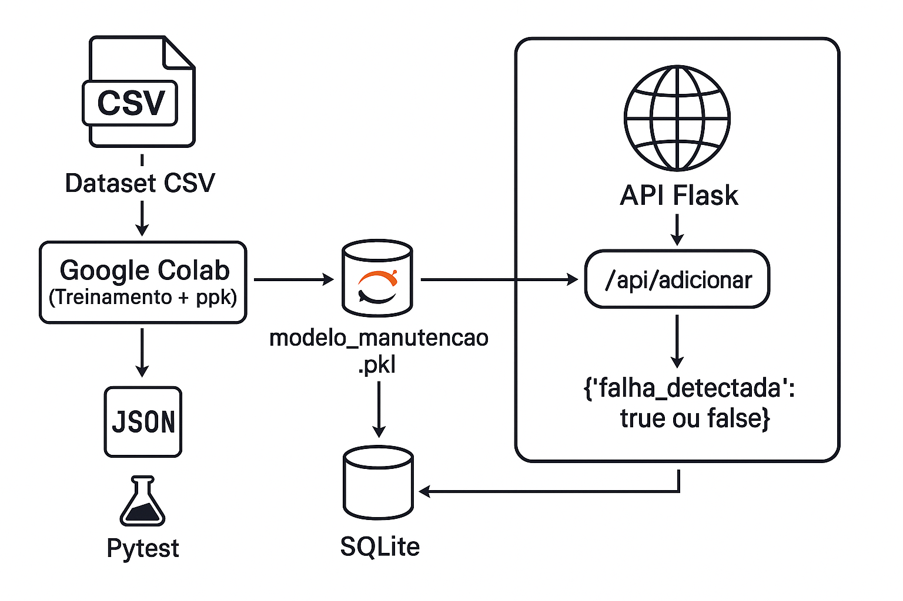

# 🛠️ MVP - Manutenção Industrial com Machine Learning

Este projeto é um MVP que aplica **Machine Learning em manutenção preditiva industrial**, utilizando o dataset **AI4I 2020 Predictive Maintenance**. A solução foi desenvolvida com:

- **Python + FastAPI** (API RESTful)
- **HTML + JS** (front-end simples)
- **Jupyter Notebook** (modelo de ML)
- **Sklearn + Joblib** (treinamento/exportação)

---

## 📁 Estrutura do Projeto

```
MVP-qualidade-seguranca-sistemas-inteligentes
│
├── api/                    # Back-end FastAPI
│   ├── app.py              # Rota principal
│   ├── logger.py           # Logs de predição
│   ├── model/              # insira o modelo .pkl treinado no colab
│   └── schemas/            # Validação com Pydantic
│
├── assets/                 # Imagens e fluxograma
├── frontend/               # HTML + JS para consumo da API
│   └── index.html
│
├── Predictive_Maintenance_MVP_Bruno.ipynb  # Notebook de treino
├── requirements.txt        # Dependências da aplicação
├── README.md               # Instruções e detalhes
└── .gitignore              # Arquivos ignorados
```

---

## 📦 Requisitos

- annotated-types==0.7.0
- anyio==4.9.0
- certifi==2025.6.15
- click==8.2.1
- colorama==0.4.6
- fastapi==0.110.0
- h11==0.16.0
- httpcore==1.0.9
- httpx==0.27.0
- idna==3.10
- iniconfig==2.1.0
- joblib==1.4.2
- numpy==1.26.4
- packaging==25.0
- pandas==2.3.0
- pluggy==1.6.0
- pydantic==2.7.1
- pydantic_core==2.18.2
- Pygments==2.19.1
- pytest==8.2.1
- pytest-asyncio==1.0.0
- python-dateutil==2.9.0.post0
- pytz==2025.2
- scikit-learn==1.6.1
- scipy==1.15.3
- six==1.17.0
- sniffio==1.3.1
- starlette==0.36.3
- threadpoolctl==3.6.0
- typing-inspection==0.4.1
- typing_extensions==4.14.0
- tzdata==2025.2
- uvicorn==0.29.0


---

## 📥 Dataset

O dataset utilizado é o **AI4I 2020 Predictive Maintenance**, disponível em:

🔗 https://archive.ics.uci.edu/dataset/601/ai4i+2020+predictive+maintenance+dataset

Baixe o arquivo CSV (`ai4i2020.csv`) e utilize no notebook diretamente no Colab.

---

## 📈 Geração do Modelo `.pkl`

1. Acesse o notebook `Predictive_Maintenance_MVP_Bruno.ipynb` (disponível na raiz do projeto)
2. Execute todas as células diretamente no Colab (em ordem)
3. O modelo será treinado e deverá ser salvo localmente como:

```bash
api/model/modelo_manutencao.pkl
```
Obs: atenção! salve o arquivo na pasta "model"
---

## 🚀 Executando a API

1. Crie e ative o ambiente virtual:

```bash
python -m venv venv
venv\Scripts\activate    # Windows
```

2. Instale as dependências:

```bash
pip install -r requirements.txt
```

3. Rode a aplicação:

```bash
uvicorn api.app:app --reload
```

4. Acesse a documentação da API:

🔗 http://127.0.0.1:8000/docs

---

## 🌐 Front-end (HTML/JS)

1. Abra `frontend/index.html` no navegador
2. Insira os valores desejados
3. Clique em "Enviar" para obter a predição via API FastAPI

---

## 📊 Fluxograma da Solução

Abaixo está o fluxograma completo da solução:



Este fluxograma resume:

- A leitura do dataset
- O treinamento e exportação do modelo `.pkl`
- A estrutura da API FastAPI e o endpoint de predição

---

## ✅ Conclusão

Este MVP demonstrou a aplicação prática de técnicas de Machine Learning em manutenção preditiva, integrando ciência de dados, engenharia de software e segurança. A arquitetura modular permite expansão futura e reuso em ambientes industriais reais.
